# 羊了个羊游戏开发

**项目ID：** project-20260227-092401  
**状态：** 🔄 进行中（83%完成）  
**开始时间：** 2026-02-27 09:24  
**预计完成：** 2026-02-27 14:00  
**类型：** Web 游戏（消除类）  

---

## 📊 项目概览

### 核心信息
- **游戏类型：** 消除类游戏
- **核心玩法：** 多层卡牌堆叠 + 三连消除
- **技术栈：** HTML5 + JavaScript + CSS3
- **目标平台：** 移动端优先，响应式设计

### 项目状态
- ✅ **需求分析** - 完成（15分钟）
- ✅ **UI设计** - 完成（30分钟）
- ✅ **前端集成** - 完成（24分钟）
- ✅ **游戏逻辑** - 完成（43分钟）
- ✅ **集成测试** - 完成（4分钟）+ Bug修复（16分钟）
- 🔄 **部署上线** - 95%完成（等待部署平台选择）

---

## 📋 快速导航

### 项目管理
- [[任务总览]] - 所有任务的进度和状态
- [[每日进展]] - 每日工作记录
- [[问题记录]] - Bug和问题追踪
- [[经验教训]] - 反思和改进

### 技术文档
- [[需求分析]] - 游戏规则和功能需求
- [[UI设计]] - 界面设计和交互流程
- [[游戏逻辑]] - 核心算法和实现
- [[测试报告]] - 测试结果和覆盖率

### 协作记录
- [[Agent协作]] - Agent间协作记录
- [[反思总结]] - 项目反思和改进

---

## 🎯 当前状态

### 进度统计
- **总任务：** 6个
- **已完成：** 5个（83%）
- **进行中：** 1个
- **待分配：** 0个

### Bug统计
- **发现：** 4个
- **已修复：** 4个（100%）
- **总用时：** 35分钟

### 质量指标
- **测试覆盖率：** 90%+ ⬆️
- **测试通过率：** 100%（37/37）
- **代码质量：** ⭐⭐⭐⭐⭐（5/5星）
- **交互完整性：** 95% ⬆️

---

## 🏆 项目成果

### 交付物
- ✅ **完整游戏**（可直接打开运行）
- ✅ **18个SVG卡牌图案**（可爱扁平化风格）
- ✅ **7000+行代码**（HTML + JavaScript + CSS）
- ✅ **37个测试用例**（100%通过）
- ✅ **完整文档**（需求、设计、API、测试）

### 技术亮点
- ✅ **事件驱动架构**（观察者模式）
- ✅ **实时状态同步**
- ✅ **流畅动画效果**（CSS3 + JavaScript）
- ✅ **移动端优先设计**
- ✅ **完整的错误处理**

---

## 📈 项目时间线

```mermaid
gantt
    title 项目时间线
    dateFormat HH:mm
    section 开发
    需求分析     :a1, 09:24, 15m
    UI设计       :a2, 10:00, 30m
    前端集成     :a3, 10:26, 24m
    游戏逻辑     :a4, 09:56, 43m
    section 测试
    集成测试     :b1, 10:46, 4m
    Bug修复      :b2, 11:05, 16m
    回归测试     :b3, 11:20, 1m
    反思改进     :b4, 12:20, 42m
```

---

## 🤝 参与Agent

| Agent | 角色 | 任务 | 状态 |
|-------|------|------|------|
| Product-AI | 需求分析 | TASK-001 | ✅ 完成 |
| UX-AI | UI设计 | TASK-002 | ✅ 完成 |
| Frontend-AI | 前端集成 | TASK-003 | ✅ 完成 |
| Backend-AI | 游戏逻辑 | TASK-004 | ✅ 完成 |
| QA-AI | 测试 | TASK-005 | ✅ 完成 |
| DevOps-AI | 部署 | TASK-006 | 🔄 95% |

---

## 🔗 相关链接

### 代码仓库
- **Gitee：** https://gitee.com/hhs44/yang-game
- **最新提交：** d8cf90e（错误处理补充）
- **总提交数：** 7个

### 本地文件
- **项目目录：** `/home/huang/.openclaw/workspace-communication-ai/projects/project-20260227-092401/`
- **游戏文件：** `game/index.html`

---

## 💡 关键经验

### 成功经验
1. ✅ **快速迭代** - 平均每个任务27分钟
2. ✅ **并行开发** - UI和逻辑同时进行
3. ✅ **立即修复** - Bug平均9分钟修复
4. ✅ **反思改进** - 所有Agent立即采取行动

### 教训总结
1. ⚠️ **测试必须多环境** - Node.js ≠ 浏览器
2. ⚠️ **代码未测试等于未完成** - 必须在真实环境验证
3. ⚠️ **枚举的键和值是两回事** - 必须明确区分
4. ⚠️ **需要建立质量把控点** - 提前发现问题

---

## 📊 反思活动成果

**反思时间：** 2026-02-27 12:20-13:02（42分钟）  
**参与Agent：** 5/6（83%）  
**立即行动改进：** 5/5（100%）

**主要改进：**
- Backend-AI：配置验证器 + 20+边界测试
- Frontend-AI：强制浏览器测试 + 错误处理
- QA-AI：E2E测试套件（18个用例）
- UX-AI：4个新文档（~44,000字）
- Communication-AI：质量把控点 + 预警机制

---

## 🎯 下一步

### 立即需要
- [ ] 选择部署平台（Vercel 推荐）
- [ ] 完成部署
- [ ] 测试线上版本

### 后续优化
- [ ] 添加更多关卡
- [ ] 实现音效系统
- [ ] 添加排行榜
- [ ] 性能优化

---

## 📝 标签

#项目/进行中 #游戏开发 #Web游戏 #消除类 #协作项目 #多Agent协作

---

_创建时间：2026-02-27 14:12_  
_最后更新：2026-02-27 14:12_  
_负责人：Communication-AI 🔗_
