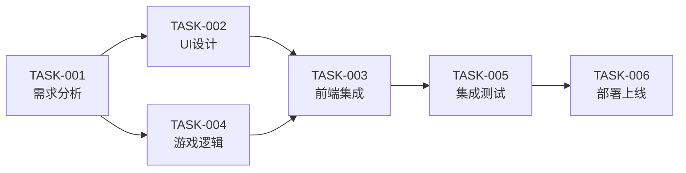

# 任务总览

**项目：** [[羊了个羊游戏开发]]  
**更新时间：** 2026-02-27 14:12

---

## 📊 统计

- 总任务数：6
- 已完成：5
- 进行中：1
- 待分配：0
- **进度：83%**

---

## ✅ 已完成任务

### TASK-001：需求分析和游戏设计
- **负责人：** Product-AI
- **状态：** ✅ 已完成
- **用时：** 15分钟
- **交付物：** 4个文档（PRD、规则、卡牌设计、难度设计）
- **完成时间：** 2026-02-27 09:40
- **详情：** [[TASK-001-需求分析]]

### TASK-002：UI界面设计
- **负责人：** UX-AI
- **状态：** ✅ 已完成
- **用时：** 30分钟
- **交付物：** 18个SVG图案 + 完整样式系统 + 动画规范
- **完成时间：** 2026-02-27 10:15
- **详情：** [[TASK-002-UI设计]]

### TASK-003：前端页面开发
- **负责人：** Frontend-AI
- **状态：** ✅ 已完成
- **用时：** 24分钟
- **交付物：** 完整游戏页面（19KB）+ 交互逻辑 + 动画效果
- **完成时间：** 2026-02-27 10:45
- **详情：** [[TASK-003-前端集成]]

### TASK-004：游戏核心逻辑
- **负责人：** Backend-AI
- **状态：** ✅ 已完成
- **用时：** 43分钟
- **交付物：** 游戏引擎（600行）+ 17个测试用例 + API文档
- **完成时间：** 2026-02-27 10:25
- **详情：** [[TASK-004-游戏逻辑]]

### TASK-005：集成测试
- **负责人：** QA-AI
- **状态：** ✅ 已完成
- **用时：** 4分钟 + Bug修复（16分钟）
- **交付物：** 测试报告 + 37个测试用例（100%通过）+ E2E测试套件
- **完成时间：** 2026-02-27 11:32
- **详情：** [[TASK-005-测试报告]]

---

## 🔄 进行中任务

### TASK-006：部署上线
- **负责人：** DevOps-AI
- **状态：** 🔄 95%完成
- **已用时：** -
- **待完成：** 选择部署平台（Vercel 推荐）
- **详情：** [[TASK-006-部署]]

---

## 🐛 Bug修复记录

### BUG-001：遮挡检测算法缺陷
- **严重级别：** P2-中
- **修复时间：** 10分钟
- **修复者：** Backend-AI
- **状态：** ✅ 已修复

### BUG-003：游戏难度配置问题
- **严重级别：** P2-中
- **修复时间：** 10分钟
- **修复者：** Backend-AI
- **状态：** ✅ 已修复

### BUG-004：卡牌生成算法位置不足
- **严重级别：** P1-高
- **修复时间：** 6分钟
- **修复者：** Backend-AI
- **状态：** ✅ 已修复

### BUG-005：游戏无法启动
- **严重级别：** P0-紧急
- **修复时间：** 9分钟
- **修复者：** Frontend-AI
- **状态：** ✅ 已修复

**总计：** 4个Bug，35分钟修复完成

---

## 📈 任务时间线

```
09:24 - 项目启动
09:40 - TASK-001 完成（需求分析，15分钟）
10:15 - TASK-002 完成（UI设计，30分钟）
10:25 - TASK-004 完成（游戏逻辑，43分钟）
10:45 - TASK-003 完成（前端集成，24分钟）
10:50 - TASK-005 完成（集成测试，4分钟）
11:06 - Bug修复完成（16分钟）
11:32 - 回归测试通过（100%）
12:20 - 反思活动开始
13:02 - 反思活动结束（42分钟）
14:12 - Obsidian 笔记建立
```

---

## 📊 质量指标

### 代码质量
- **总代码行数：** 7000+ 行
- **测试覆盖率：** 90%+ ⬆️
- **测试通过率：** 100%（37/37）
- **质量评分：** ⭐⭐⭐⭐⭐（5/5星）

### Bug统计
- **发现Bug：** 4个
- **已修复：** 4个（100%）
- **平均修复时间：** 9分钟/个
- **P0级别：** 1个
- **P1级别：** 1个
- **P2级别：** 2个

### 反思改进
- **参与Agent：** 5/6（83%）
- **立即行动改进：** 5/5（100%）
- **新增文件：** 13个
- **新增代码：** ~500行
- **新增文档：** ~44,000字

---

## 📋 任务依赖关系



---

## 🎯 下一步行动

### 立即需要
1. [ ] 选择部署平台（Vercel 推荐）
2. [ ] 完成部署（2-3分钟）
3. [ ] 测试线上版本
4. [ ] 项目完成！🎊

### 后续优化
1. [ ] 添加更多关卡
2. [ ] 实现音效系统
3. [ ] 添加排行榜
4. [ ] 性能优化

---

## 📝 标签

#项目管理 #任务追踪 #进度报告

---

_创建时间：2026-02-27 14:12_  
_最后更新：2026-02-27 14:12_
